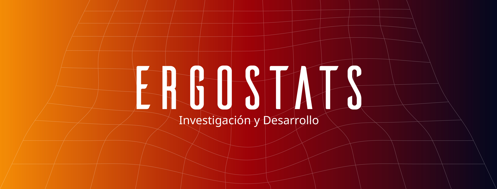

 


<h1 align = "center"> 
Alejandría, un reporsitorio para la investigación con Registros Administrativos Públicos 
</h1>


Repositorio para el almacenamiento de los **scripts** para la generación de las tablas de trabajo del tablero Alejandria


Intrucciones para acceso:

```

# install.packages("pins")

library(pins)

```

# Temporada 1: Recursos y actividades de Salud

## URL:

https://www.ecuadorencifras.gob.ec/actividades-y-recursos-de-salud/

## Metadatos:

url de los metadatos (apuntan a un rmd)

## Diccionario:

url al dicionario (apuntan a un rmd)


